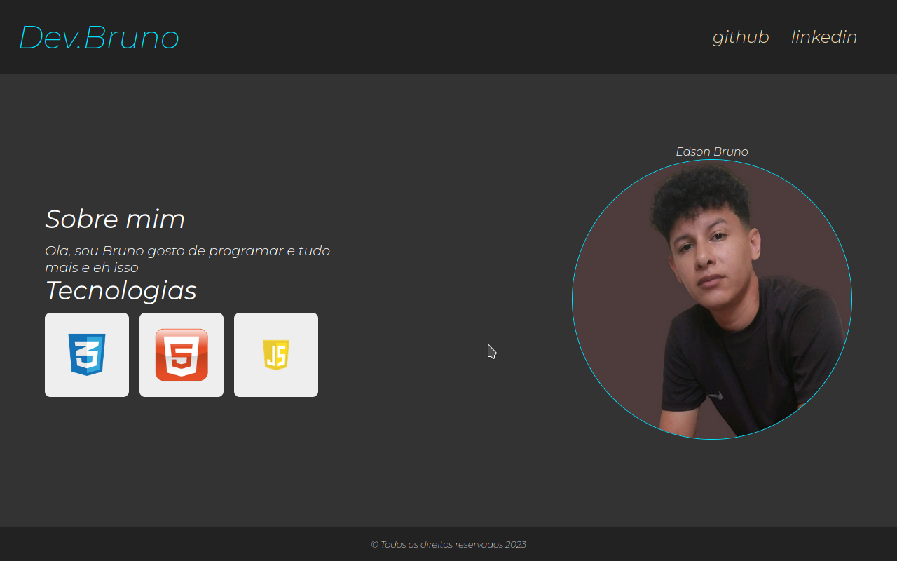

 <h1>Estilos do Portfólio</h1>

 <h2>img</h2>

   
Este README fornece uma visão geral dos estilos CSS aplicados à seção de portfólio de uma página web. A seção de portfólio foi projetada para destacar a introdução de um desenvolvedor, uma lista de tecnologias utilizadas e uma imagem com um efeito de destaque.

   <h2>Detalhamento dos Estilos</h2>

  <h3>Estilos Principais</h3>
  <ul>
  <li>O preenchimento é de 5% da largura do contêiner principal.</li>
   <li>Utiliza um contêiner flexível para alinhar itens verticalmente e justificá-los com espaço entre eles.</li>
   </ul>
  <h3>Estilos do Conteúdo Principal</h3>
    <ul>
     <li>O conteúdo principal é estruturado como um contêiner flexível com direção de coluna.</li>
      <li>O cabeçalho (h2) tem um tamanho de fonte de 2,2em e uma margem inferior de 2%.</li>
      <li>Os parágrafos têm uma largura de 75%, um tamanho de fonte de 1,2em e um peso de fonte mais leve (300).</li>
                </ul>
   <section>
 <h3>Estilos da Seção de Tecnologias</h3>
      <ul>
 <li>A seção de tecnologias inclui um contêiner flexível para os cartões, com alinhamento vertical.</li>
 <li>Os cartões individuais têm dimensões de 120px por 120px com preenchimento, uma cor de fundo clara e cantos arredondados.</li> <li>Um sutil efeito de destaque é aplicado com uma sombra de caixa ao passar o mouse.</li>
 </u>
  <h3>Estilos da Seção de Imagem</h3>
     <ul>
   <li>A seção de imagem é um contêiner flexível com direção de coluna invertida, alinhando os itens verticalmente no centro e justificando-os no centro horizontalmente.</li>
 <li>A imagem é circular, com dimensões de 400px por 400px, possui uma borda com um efeito de destaque ao passar o mouse através de uma sombra de caixa.</li>
  </ul>
  </section>
  </article>
    <article>
<h2>Utilização</h2>
  
Integre esses estilos ao seu arquivo de estilo CSS para aplicá-los à seção de portfólio. Certifique-se de que a estrutura HTML corresponda à estrutura assumida por esses estilos. Sinta-se à vontade para personalizar cores, dimensões e transições para criar uma seção de portfólio única e visualmente atraente.

    </article>
